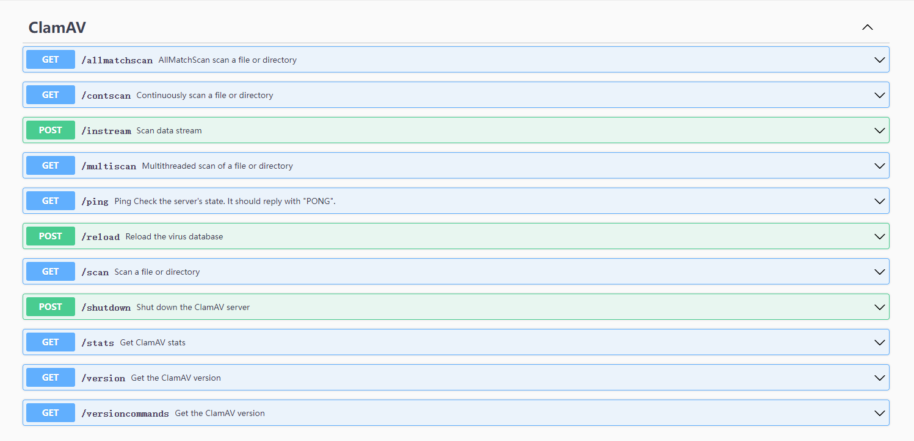

# go-clamav

go-clamav是一个用Go语言编写的库和工具集，旨在与ClamAV防病毒软件进行无缝集成。它提供了一个简洁易用的REST API，用于调用ClamAV扫描、获取统计信息、版本信息等功能。同时，go-clamav 还包含一个命令行工具clamd-ctl，用于与 Clamd守护进程通信并执行各种操作。

# 核心功能

go-clamav 提供了丰富的核心功能来与 ClamAV 服务器进行交互。这些功能包括但不限于：

- Ping: 检查 ClamAV 服务器是否可达。
- Version: 获取 ClamAV 版本信息。
- VersionCommands: 获取 ClamAV 版本和支持的命令列表。
- Stats: 获取 ClamAV 的统计信息。
- Scan: 扫描单个文件或目录。
- ContScan: 连续扫描文件或目录。
- MultiScan: 并行扫描多个文件或目录。
- AllMatchScan: 扫描文件或目录，并在找到匹配时继续扫描。
- Instream: 通过流方式扫描数据。
- Reload: 重新加载病毒数据库。
- Shutdown: 关闭 ClamAV 服务器。

# 快速开始

- 安装clamav

使用 APT（Debian/Ubuntu）

```bash
sudo apt-get update
sudo apt-get install -y clamav clamav-daemon
```

## 安装go-clamav
首先，你需要安装 Go 编译器并设置好开发环境。然后你可以通过以下命令获取 go-clamav

```bash
go get -u github.com/yourusername/go-clamav
```

## 使用示例

下面是一些简单的示例，演示如何使用 go-clamav 库连接到 ClamAV 服务器并执行基本的操作。

### TCP 连接 ClamAV

```go
package main

import (
    "fmt"
    "github.com/hq0101/go-clamav"
	"time"
)

func main() {
	client := clamav.NewClamClient("tcp", "192.168.229.173:3310", 10*time.Second, 30*time.Second)

	response, err := client.Ping()
	if err != nil {
		fmt.Println("Error:", err)
		return
	}

	fmt.Println("Response from ClamAV:", response)

	version, err := client.Version()
	if err != nil {
		fmt.Println("Error:", err)
		return
	}
	fmt.Println("ClamAV Version:", version)
}
```
编译并运行你的程序

```bash
go run main.go
```

### unix 套接字连接Clamd

```go
package main

import (
    "fmt"
    "github.com/hq0101/go-clamav"
	"time"
)

func main() {
	client := clamav.NewClamClient("unix", "/var/run/clamav/clamd.ctl", 10*time.Second, 30*time.Second)

	// Ping ClamAV server
	response, err := client.Ping()
	if err != nil {
		fmt.Println("Error:", err)
		return
	}
	fmt.Println("Ping Response from ClamAV:", response)

	// Get ClamAV version
	version, err := client.Version()
	if err != nil {
		fmt.Println("Error:", err)
		return
	}
	fmt.Println("ClamAV Version:", version)
}

```

编译并运行你的程序

```bash
go run main.go
```


# API文档

go-clamav 使用 Swagger 进行了文档化，方便开发者查阅和测试。

- 启动clamd-api 服务

```shell
make run
```

浏览器打开swagger http://127.0.0.1:8080/swagger/index.html




# clamd-ctl 使用手册

clamd-ctl是一个Go语言编写的命令行工具，用于与ClamAV服务器进行通信，并执行各种操作。

## 使用方法

- 帮助手册

```bash
clamd-ctl-v0.1.linux-amd64 -h
```

- 使用TCP连接clamd

```bash
clamd-ctl-v0.1.linux-amd64 ping -a 192.168.127.131:3310 -n tcp
```

- 使用UNIX套接字连接clamd

```bash
clamd-ctl-v0.1.linux-amd64 ping -a /var/run/clamav/clamd.ctl -n unix
```

- 使用配置文件

创建一个配置文件，例如 clamd-ctl.yaml

```yaml
clamd_network_type: "tcp"             # 连接类型，可以是 "tcp" 或 "unix"
clamd_address: "127.0.0.1:3310"       # clamd 服务器地址（对于 TCP）或套接字路径（对于 UNIX）/var/run/clamav/clamd.ctl
clamd_conn_timeout: "10s"             # 连接超时时间
clamd_read_timeout: "30s"             # 读取超时时间
```

使用此配置文件运行命令
```bash
clamd-ctl-v0.1.linux-amd64 ping -f ./configs/clamav-cli.yaml
```

- 获取 ClamAV 版本

```bash
clamd-ctl-v0.1.linux-amd64 version -a 192.168.127.131:3310 -n tcp
clamd-ctl-v0.1.linux-amd64 versioncommands -a 192.168.127.131:3310 -n tcp
```

- 获取 ClamAV 统计信息

```bash
clamd-ctl-v0.1.linux-amd64 stats -a 192.168.127.131:3310 -n tcp
```

- 扫描单个文件或目录

```bash
clamd-ctl-v0.1.linux-amd64 /path/to/file -a 192.168.127.131:3310 -n tcp
```

- 连续扫描文件或目录

```bash
clamd-ctl-v0.1.linux-amd64 contscan /path/to/file -a 192.168.127.131:3310 -n tcp
```

- 并行扫描多个文件或目录

```bash
clamd-ctl-v0.1.linux-amd64 multiscan /path/to/file -a 192.168.127.131:3310 -n tcp
```

- 扫描文件或目录并在找到匹配时继续扫描

```bash
clamd-ctl-v0.1.linux-amd64 allmatchscan /path/to/file -a 192.168.127.131:3310 -n tcp
```

- 重新加载病毒数据库

```bash
clamd-ctl-v0.1.linux-amd64 reload -a 192.168.127.131:3310 -n tcp
```

- 关闭 ClamAV 服务器

```bash
clamd-ctl-v0.1.linux-amd64 shutdown -a 192.168.127.131:3310 -n tcp
```

- 流方式扫描数据

```bash
clamd-ctl-v0.1.linux-amd64 instream "X5O!P%@AP[4\PZX54(P^)7CC)7}$EICAR-STANDARD-ANTIVIRUS-TEST-FILE!$H+H*" -a 192.168.127.131:3310 -n tcp
```

通过以上命令，你可以方便地与 ClamAV 服务器进行互动，并利用其强大的防病毒功能来保护你的系统。
希望这些内容能帮助你快速上手 go-clamav 项目。如果有任何问题或建议，欢迎提交issue或 pull request！
